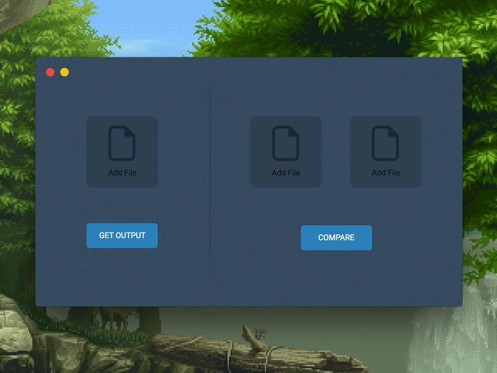
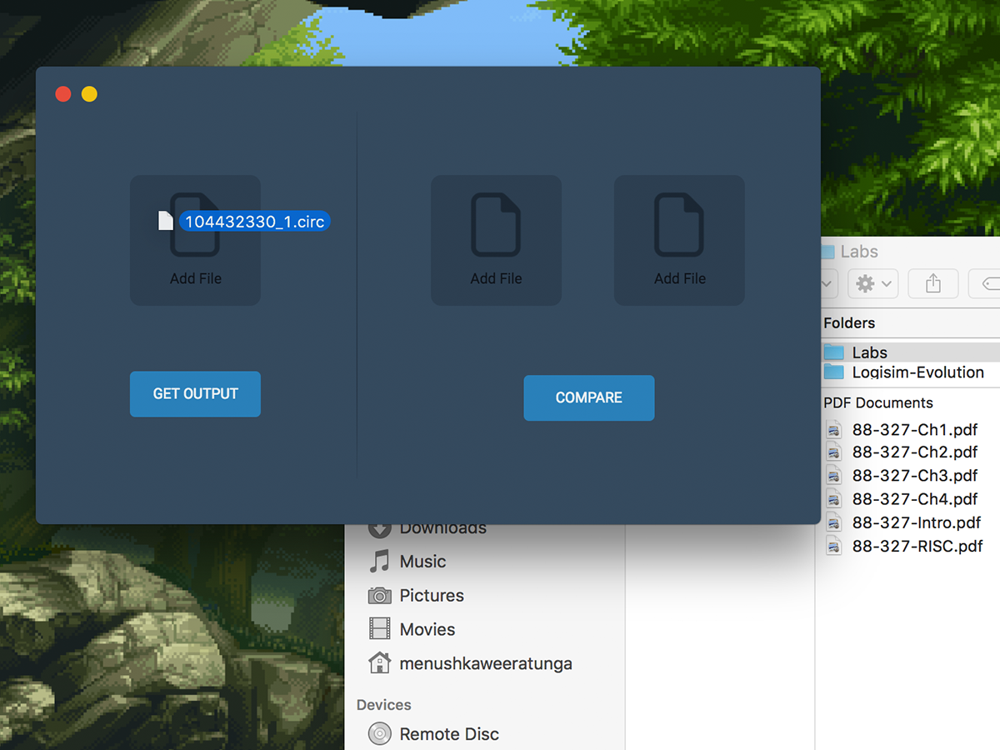
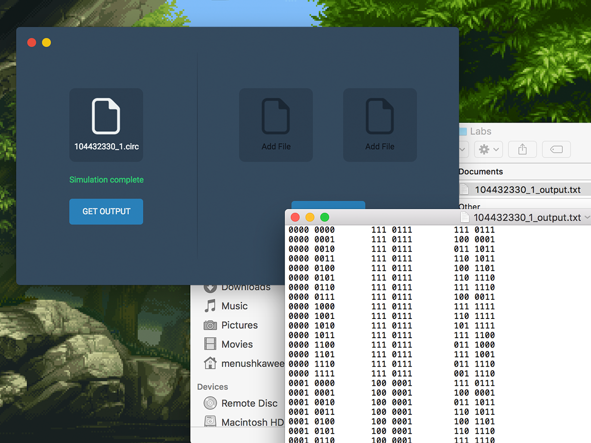
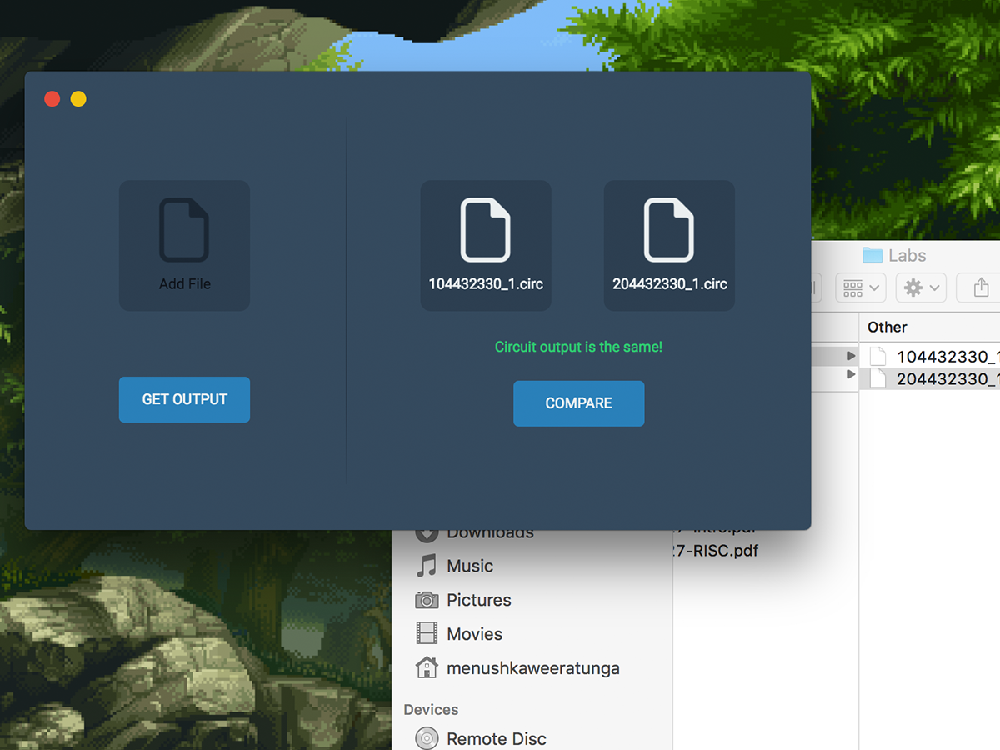

# Logisim Checker

Logisim Checker is a simple tool to quickly analyze Logisim Evolution circuit files.  The tool can both save the raw output of the circuit and compare two circuit files directly.



## Download

The latest version can be downloaded from the [releases page].  [**Make sure you have the Java JDK installed on your system. Just the JRE won't work.**]

*A Linux version should technically be able to be built, but I didn't have a install version to test on so I didn't bother.  Instructions on how to compile and build your own version are included below.*

[releases page]: https://github.com/menushka/Logisim-Checker/releases
[**Make sure you have the Java JDK installed on your system. Just the JRE won't work.**]: http://www.oracle.com/technetwork/java/javase/downloads/index.html

## How to Use

### Get Circuit Output

Drag and drop file or click to open file explorer.  Click **Get Output** to run simulation.

<br/>

Use save dialog to save .txt output to file.



### Compare Two Circuit Files

Drag and drop file or click to open file explorer and select two circuit files.  Click **Compare** to run simulation.



## Building / Modifying

### Installing

Logisim is built on Electron.js using Typescript, therefore should built for any system that Electron.js supports.  The project uses NPM as its package manager so you will need that installed on your system as well as Node.js.

First clone the repository, install the dependencies and compile typescript.

```
git clone https://github.com/menushka/Logisim-Checker.git
cd Logisim-Checker/
npm install
npm run compile
```

Finally the app should be able to be run with: 
```
npm start
```

### Distribution

The package currently supports Mac and Windows, but Linux should technically also work.  To compile the project to Mac or Windows, use the following commands:
```
npm run build-mac
npm run build-win
```

#### Linux

Again not officially supported but this command should work, if not your on your own mate.
```
electron-packager . 'Logisim Checker' --platform=linux --arch=x64 --icon=icons/icon.png --out=builds --prune=true --ignore=screenshots --asar.unpack=logisim-evolution.jar --overwrite
```
Add this to the package.json and run.

## License

This project is licensed under the MIT License.

